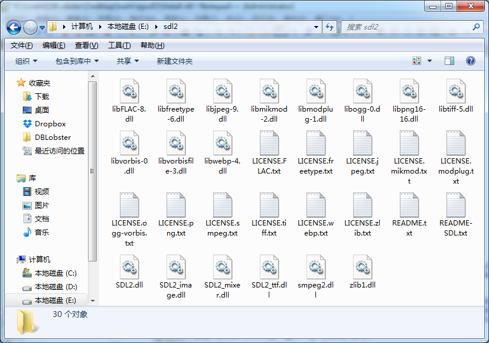

安装 PySDL2
===========
本章节讲解 PySDL2 的安装.

* 使用的操作系统 Windows 7 和 Debian 8.
* 使用的 Python 为 3.4. 如果你使用 3.5 也没有问题, Windows
  版除了安装界面略有变化, 并没什么特殊地方.

在 Windows 7 64 位版下安装基础环境
----------------------------------
在 Windows 下, 我们使用最新版本的 SDL2.

我们首先需要下载各个软件:

* 64 位 Python 3.4.4: https://www.python.org/ftp/python/3.4.4/python-3.4.4.amd64.msi
* 64 位 SDL 2.0: https://www.libsdl.org/release/SDL2-2.0.4-win32-x64.zip
* 64 位 SDL 扩展库:

  - SDL_image: https://www.libsdl.org/projects/SDL_image/release/SDL2_image-2.0.1-win32-x64.zip
  - SDL_mixer: https://www.libsdl.org/projects/SDL_mixer/release/SDL2_mixer-2.0.1-win32-x64.zip
  - SDL_ttf: https://www.libsdl.org/projects/SDL_ttf/release/SDL2_ttf-2.0.14-win32-x64.zip

安装 Python 3.4.4 就一直下一步 (Next) 即可.

SDL2 和 SDL 扩展库解压缩放在一起. 其中 README.txt, zlib1.dll, LICENSE.zlib.txt
有多份, 直接覆盖即可, 不会出现程序的问题. 完成后如下图所示.
之后我们的工作目录也是这个目录, 所有 py 的脚本文件都在此目录运行才能生效.
以后我将使用 `工作目录` 代指这个目录.

|SDL2-unzipped|

.. note::

  在 64 位版 Windows 7 下使用使用 32 位版的 Python, 与 64 位版 Python 类似,
  请特别注意, Python 与 SDL 的一致, 即同为 64 位或同为 32 位.

  使用 32 位版的 Windows 7, 与使用 64 位版 Windows 7 类似. 注意将 Python 与 SDL
  换为 32 位版.

  32 位版可能的其他称呼有 x86, x32. 64 位版可能的其他称呼有 x64, x86_64.

  其他版本的软件, 可以从以下地址下载:

    - Python: https://www.python.org/downloads/
    - SDL 2.0: https://www.libsdl.org/download-2.0.php
    - SDL_image, SDL_mixer, SDL_ttf: https://www.libsdl.org/projects/

  SDL2_gfx (http://www.ferzkopp.net/wordpress/2016/01/02/sdl_gfx-sdl2_gfx/)
  暂时没有编译好的二进制版本, 所以暂时没有使用.

.. note::

  如果你知道如何设置 Windows 环境变量, 那你可以将所有的 DLL 文件放到一个目录,
  再将这个目录添加到 ``PATH`` 环境变量里, 这样我们的 `工作目录` 将更加简洁.

  PySDL2 还可以使用 ``PYTHONPATH`` 环境变量来指定, 具体请看它的文档.

  操作方法: 计算机 -> 右键"属性" -> 高级系统设置 -> "高级"选项卡 -> 环境变量 ->
  双击"系统变量"里 PATH 进行修改.

在 Debian 8 下安装基础环境
--------------------------
在 Debian 下, 我们使用系统自带的 Python3, SDL2, SDL2 扩展库. 命令如下::

  aptitude install python3

  aptitude install libsdl2-2.0-0

  aptitude install libsdl2-image-2.0-0 libsdl2-mixer-2.0-0 libsdl2-ttf-2.0-0 libsdl2-gfx-1.0-0

如果你需要一个和 Windows 下一样的简单开发环境, 请安装 IDLE::

  aptitude install idle-python3.4

.. note::

  Debian 是一个 GNU/Linux (或称为 Linux) 发行版. 理论上, Ubuntu 可以按照 Debian
  的方式操作, 不过我没有做测试. 其他 GNU/Linux 发行版还请参考各自系统的包管理器.

安装 PySDL2
-----------
PySDL2 我们使用 pip 命令安装::

  pip3 install pysdl2

撰写本文时, PySDL2 的版本是 0.9.3, 0.9.4 版已经准备好, 但还未发布.

如果你技术过硬, 也可以尝试使用 hg (Mecurial) 来获取最新版本, 然后将 sdl2
文件夹复制到 `工作目录`.

如果你有系统管理员权限, 并且使用 hg 版或者下载的压缩包版, 进入 PySDL
目录后, 可以执行以下命令, 将 PySDL2 安装到系统内::

  python3 setup.py install

.. note::

  PySDL2 最低要求 Python 2.7 或 3.2 以上版本, 或者 PyPy 1.8.0 以上版本.

  直接下载地址:

  * https://bitbucket.org/marcusva/py-sdl2/downloads
  * https://pypi.python.org/pypi/PySDL2
